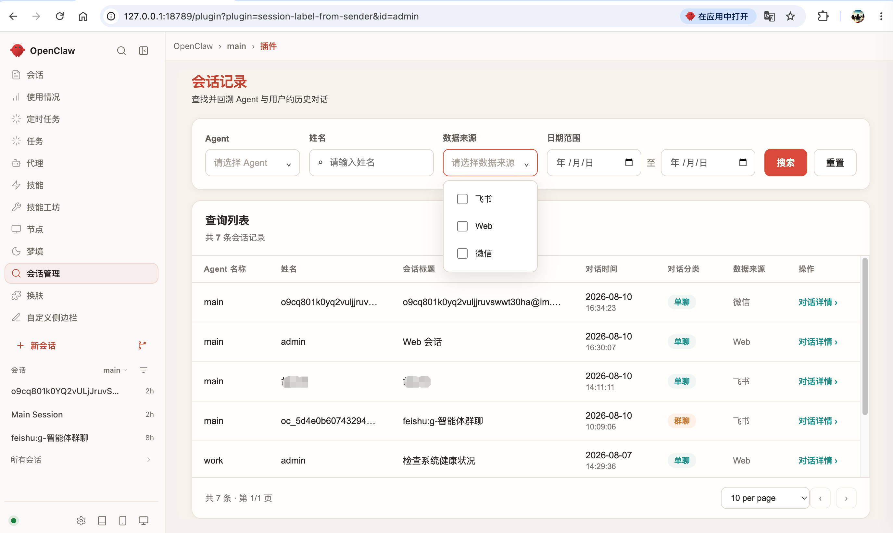
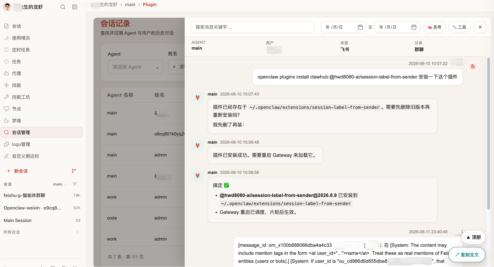

# Session Label from Sender

> OpenClaw 会话管理后台 —— 按渠道 / 用户 / 日期检索对话，并解决 `/new` 之后旧对话在原生后台「消失」的痛点。

`session-label-from-sender` 是一个 OpenClaw 扩展插件，把分散在多个渠道（WebUI、飞书、微信）下的会话集中到一个管理界面，让管理人可以按**渠道、用户名称、日期**筛选检索会话列表，并查看任意一段对话的完整时间线。它的核心价值在于：以「发送者」维度聚合，使得用户在聊天里执行 `/new` 之后，之前的历史对话依然连贯可查——这是 OpenClaw 原生后台做不到的。

---

## 为什么需要这个插件（目的与价值）

OpenClaw 原生的「会话」是围绕 `sessionId` 组织的，日常使用与管理中存在两个原生后台解决不了的痛点：

1. **后台无法按「渠道 / 用户 / 日期」检索历史对话。** 客服、运营或开发者想回看「某个飞书客户上周聊了什么」「微信里某个用户的所有咨询」，原生界面没有一个集中、可筛选的检索入口，只能翻聊天窗口，难以复盘与追溯。
2. **`/new` 之后，原生后台看不到旧对话了。** 用户在聊天里发送 `/new`（或任何让 OpenClaw 重建 `sessionId` 的操作）时，OpenClaw 会把旧的 `sessionId.jsonl` 重命名为 `*.jsonl.reset.<ts>.json` 封存，并新建一个 session 写入新文件。对原生后台而言，这是「一段全新会话」，**之前的所有历史对话就此从原生界面消失，无法追溯**。

**这个插件的目的，就是补上这个「会话管理后台」，并且只聚焦于两件事：**

- **① 会话列表查询**：按渠道、用户名称、日期范围筛选检索，快速定位目标客户/会话。
- **② 会话详情查询**：以时间线方式完整查看一段对话（用户文本、助手回复、思考过程、工具调用/结果）。

**关键设计带来核心价值**：插件以「发送者」维度（`session_key` = agent + 渠道 + 发送者身份，**而不是** OpenClaw 的 `sessionId`）聚合。因此**即使客户多次 `/new`，他所有的历史对话仍归并到同一个人名下，一条记录连贯可查**——彻底解决了 `/new` 后旧对话在原生后台「消失」的痛点。

> 一句话总结价值：**让管理人能在后台，按渠道 / 用户 / 日期，把客户的所有对话（含 `/new` 之前的）完整、连续地查出来。**

---

## 功能特性

围绕上述目的，插件提供以下用户侧能力（底层同步 / 去重 / 重排等技术细节见「工作原理要点」）：

- **会话列表查询（核心）**：聚合所有渠道（WebUI / 飞书 / 微信）的所有会话到一张列表，支持按「姓名」「会话标题」「来源渠道」筛选，并支持按时间范围检索。
- **会话详情查询（核心）**：以时间线方式完整呈现一段对话，包含用户文本、助手回复、思考过程（折叠）、工具调用 / 工具结果（工具卡）。
- **发送者自动标注**：
  - 通过 WebUI 创建的会话，发送者统一显示为 `admin`；
  - 飞书 / 微信等 IM 渠道，能拿到真实昵称就显示昵称，否则退化为显示发送人 ID（openid / 微信号等）。
- **全文复制**：一键把整段对话复制到剪贴板（受插件 iframe 沙盒限制，下载降级为复制，详见「已知平台限制」）。
- **`/new` 会话旋转自愈**：执行 `/new` 后，新消息能自动同步进来并归并到同一发送者记录，不会卡在旧历史。

## 效果预览

### 1. 会话列表 —— 多渠道聚合、按人归一



聚合所有渠道（WebUI / 飞书 / 微信）的全部会话到一张表：

- **姓名列**：取自 `sender_name`——WebUI / dashboard 会话固定显示 `admin`；IM 渠道能拿到真实昵称用昵称（飞书的用户姓名），否则降级到发送人 ID（openid / 微信号）。
- **会话标题列**：取自 `display_name`，三级回退保证**永远非空**（`entry.displayName` → `sender_name` → 渠道通用标题）。
- **来源渠道列**：按 `session_key` 推导（`feishu` / `weixin` / `webchat`），**不**信 `entry.origin.provider`（微信会被误报成 `webchat`）。
- **左下筛选**：按姓名 / 会话标题关键字 + 起止日期 + 渠道过滤；右侧「复制全文」按钮把整个会话复制到剪贴板（不是下载——见「已知平台限制」）。
- **核心视觉**：同一个客户在聊天里执行过多次 `/new` 之后，**所有历史会话仍归到同一行**——这是「按发送者聚合」最直观的体现，原生后台会把他们切成多个 session，旧的直接消失。

### 2. 会话详情 —— 时间线 + 工具卡



- 顶部面包屑：插件名 → 返回列表。
- 中部「消息 N 条」摘要 + 渠道 / 发送者 / 起止时间元数据。
- 主区域按时间倒序/正序展示完整对话：
  - 用户气泡（右侧）、助手气泡（左侧）。
  - 助手回复里的「思考过程」默认折叠，鼠标移上去显示「点击展开」字样；展开后看到原始 reasoning。
  - 工具调用 / 工具结果显示为折叠卡片，里面 JSON 或 stdout 文本；只显示必要元数据，不展开控件。
- 不依赖任何客户端 JS：所有数据通过 SSR 渲染进 HTML——硬刷新失败、脚本被禁时仍可阅读（仅交互增强失效）。

---

## 安装

### 方式一：从 ClawHub 安装（推荐）

在 OpenClaw 中通过 ClawHub 搜索并安装 `@hwd8080-ai/session-label-from-sender`（兼容 `pluginApi >= 2026.7.1`，宿主版本 `>= 2026.7.1`）。

### 方式二：从源码构建部署

```bash
# 1. 克隆仓库
git clone https://github.com/hwd8080-ai/session-label-from-sender.git
cd session-label-from-sender

# 2. 构建（需要 Node >= 22.5，因为用到了 node:sqlite）
node build.mjs
# 产物：根目录 index.mjs 与 dist/index.mjs（esbuild 自包含 bundle）

# 3. 部署到 OpenClaw 扩展目录
mkdir -p ~/.openclaw/extensions/session-label-from-sender
cp -r dist/index.mjs openclaw.plugin.json ~/.openclaw/extensions/session-label-from-sender/
# 注意：dist/index.mjs 才是运行时入口（见 openclaw.plugin.json 的 extensions 字段）

# 4. 重启 daemon
openclaw daemon restart
```

安装后，在 OpenClaw 控制界面的「更多」区域会看到 **会话记录（Session Admin）** 标签页，点击进入即可。

> 说明：插件页面通过 `auth: "plugin"` 直连网关（默认 `127.0.0.1:18789`），无需二次 token。页面路径 `/plugins/session-admin`，数据接口 `/plugins/session-admin/api/*`。

---

## 字段语义说明

插件维护一张 `sessions` 表，其中几个关键字段的语义如下（也是列表页「姓名」「会话标题」「来源」列的数据来源）：

| 字段 | 含义 | 取值规则 |
| --- | --- | --- |
| `sender_name` | **姓名列**数据源 | WebUI / dashboard 会话 → `admin`；IM 渠道有真实昵称用昵称，否则用发送人 ID（openid / 微信号）。 |
| `display_name` | **会话标题 / 主题**，列表行标题，**永远非空** | 三级回退：OpenClaw 的 `entry.displayName` → 回退 `sender_name` → 再回退渠道通用标题（Web 会话 / 飞书 / 微信 等）。 |
| `label` | OpenClaw 原生会话标签 | 由 OpenClaw 自己管理（1:1 私聊时 inbound hook 会写入 senderName），基本为空是正常现象，**不作为主展示字段**。 |
| `channel` | 来源渠道 | **必须按 `session_key` 推导**（`feishu` / `weixin` / `webchat`），不能信 `entry.origin.provider`（微信场景会被误报成 `webchat`）。 |
| `is_group` | 是否群聊 | 纯信任 `session_key` 中的 `:group:` / `:direct:` 分类，**不**靠扫消息内容启发式判断（飞书单聊消息同样带 `ou_xxx: 文本` 前缀，会误判）。 |

`sender_name` 与 `display_name` 的计算逻辑集中在 `sync.ts`（`computeSenderName` / `computeDisplayName` / `channelFromSessionKey` 等），与 OpenClaw 原始行为对齐。

---

## 数据存储位置

插件的 SQLite 数据库固定放在**插件自己的目录**，与 OpenClaw 核心文件分离，便于备份与清理：

```
~/.openclaw/extensions/session-label-from-sender/data/session-admin.db
```

该目录下还会自动生成同名的 `-shm` / `-wal` 附属文件（WAL 模式），三者需一起对待（备份 / 迁移时一并处理）。

- 会话列表、消息、筛选、分页、搜索 **全部查询这份 SQLite**，前端不直接读取 JSONL 文件。
- 数据源是 OpenClaw 原生 JSONL 转录：`<stateDir>/agents/<agentId>/sessions/<sessionId>.jsonl`，仅在「同步」时按字节偏移增量解析写入。
- 同步触发（无手动按钮，全自动）：① 每次请求会话列表（`/api/sessions`）时服务端先做轻量 registry 同步，新会话行近实时出现；② 打开会话详情（`/api/messages`）时服务端增量同步该会话的消息内容；③ daemon 内定时（默认 5 分钟）全量同步所有会话内容兜底。

---

## 已知平台限制

这些限制来自 OpenClaw 的插件 iframe 沙盒机制，**非插件 bug**，也无法在不改 OpenClaw 主仓库的前提下解决：

1. **文件下载不可行 → 降级为「复制全文」**
   OpenClaw 给插件 iframe 的 sandbox 只有 `allow-scripts`，**没有** `allow-downloads` / `allow-popups`。因此浏览器会静默拦截插件内触发的文件下载。插件改为「复制全文」按钮（`navigator.clipboard` + `execCommand` 兜底），把整段对话复制到剪贴板。

2. **首屏 strict 沙盒竞态（未根治：根因在 OpenClaw 主程序 + 插件降级兜底）**
   **根因不在插件，在 OpenClaw 主程序**：`ui/src/pages/plugin/plugin-page.ts` 用 `@consume({context:applicationContext, subscribe:false})` 读取沙盒配置。首屏应用上下文（含 `gateway.controlUi.embedSandbox` 是否放行脚本）往往尚未加载完，于是 iframe 以默认的 `strict` 沙盒（禁脚本）建立；又因 `subscribe:false` 不订阅后续更新，**已建好的严格沙盒不会追溯放开脚本**。表现即：硬刷新插件页一次会报 `Blocked script execution ... allow-scripts not set`，页面脚本不执行（关键字搜索 / 消息内查找 / 复制全文等交互失效），切走再切回才正常。
   **当前状态：未解决**。该问题只能改 OpenClaw 主仓库（`subscribe:false` 改为订阅，或等配置就绪再渲染 iframe）才能根除，插件作为扩展无法绕过。
   **插件侧的降级兜底（注意：非根治）**：鉴于首屏可能落在严格沙盒里，插件用**服务端渲染（SSR）**保证"静态可用"——数据直接渲染进 HTML，翻页 / 筛选 / 进入详情用 `<a>` 链接；列表与详情在打开时由服务端自动触发对应同步，无需手动按钮。这样即便脚本被禁，列表 / 筛选 / 详情 / 导出仍可通过纯链接完成；但**交互增强在脚本恢复前不可用，且硬刷新报错本身不会因 SSR 而消失**。
   **临时规避（不稳定）**：报错后切到别的菜单再切回插件 Tab，或进 Tab 前先逛一下首页让配置加载完，通常可让脚本沙盒生效；仍偶发，非稳定方案。

---

## 工作原理要点

- **按发送者聚合（解决 `/new` 痛点）**：`session_key` 格式为 `agent:main:feishu:direct:ou_xxx`（基于 agent + 渠道 + 发送者身份生成，**不含 sessionId**）。`/new` 只会旋转底层 `sessionId`（transcript 文件名变、旧文件封存为 `*.reset.<ts>.json`），`session_key` 不变。插件以 `session_key` 为主键，检测到 `session_id` 变化即重置 `sync_cursor` 从新文件重读，再经 `renumberSeq` 按时间戳排成连续时间线——于是同一客户无论 `/new` 几次，历史都归并到同一条记录。
- **增量同步**：`sync.ts` 按 `session_key` 记录每个会话 JSONL 的字节偏移 `sync_cursor`，下次只解析新增部分。
- **重复消息根治**：插件有两套解析器（标准 `.jsonl` 用 OpenClaw 原生短哈希 id；`.trajectory.jsonl` 用 `${sessionId}-m${i}` id），id 方案不同会导致 `INSERT OR IGNORE` 拦不住重复。改用**内容级唯一索引**（`session_key, role, type, timestamp, substr(content_json,1,200)`）去重。
- **时间线乱序根治**：各解析器各自分配的 `seq` 范围交叠、不可信。`sync` 后用 `renumberSeq()` 按 `timestamp ASC, id ASC` 把该会话 `seq` 重排为 1..N 连续，保证 `ORDER BY seq` 等于时间线。

---

## 构建与开发

- 构建：`node build.mjs`（esbuild 打包，要求 Node >= 22.5，因使用 `node:sqlite`）。
- 部署：把 `dist/index.mjs` 覆盖到 `~/.openclaw/extensions/session-label-from-sender/dist/`，然后 `openclaw daemon restart`。
- 前端 `ui.ts` 的浏览器端 JS 全部以 `js.push("...")` 行拼接，HTML 属性双引号需写成 `\"`；改这类行建议用 Python 原始三引号字符串逐行重写，改完务必 `node build.mjs` 验证不报错。

---

## 链接

- GitHub：<https://github.com/hwd8080-ai/session-label-from-sender>
- ClawHub：`@hwd8080-ai/session-label-from-sender`
- 版本：`2026.8.11`（兼容 `pluginApi >= 2026.7.1`）

---

## 许可证

本插件随仓库许可证发布；如需变更请查看仓库 LICENSE 文件。
