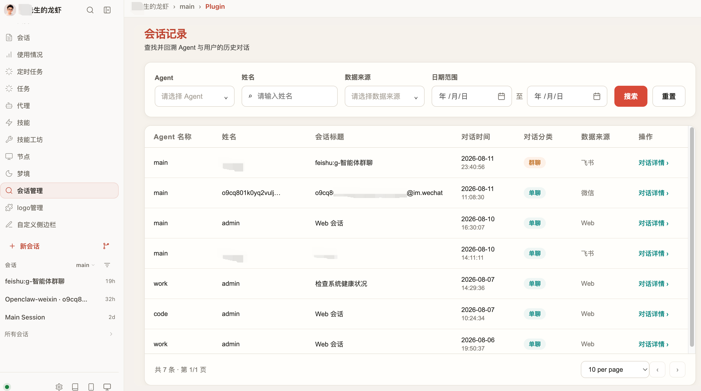

[🇨🇳 中文](README.md) · [🇺🇸 English](README.en.md)

# Session Label from Sender

OpenClaw 会话管理后台：把分散在各渠道（WebUI / 飞书 / 微信）的对话集中到一个界面，按**渠道、用户、日期**检索会话列表，并查看任意一段对话的完整时间线。它最大的价值是：以「发送者」维度聚合，用户发 `/new` 旋转会话后，旧对话依然连贯可查——这是 OpenClaw 原生后台做不到的。

## 解决了什么问题

OpenClaw 原生「会话」围绕 `sessionId` 组织，日常有两个原生后台解决不了的痛点：

1. **无法按渠道 / 用户 / 日期检索历史对话。** 想回看「某飞书客户上周聊了什么」「微信里某个用户的所有咨询」，原生界面没有集中、可筛选的入口，只能翻聊天窗口。
2. **`/new` 之后旧对话在原生后台「消失」。** 用户发 `/new` 时，OpenClaw 把旧 `sessionId.jsonl` 封存并新建会话，对原生后台而言是一段全新会话，之前的历史就此看不见。

本插件补上这个「会话管理后台」，并聚焦于两件事：**① 会话列表查询**（按渠道、用户、日期筛选）+ **② 会话详情查询**（时间线查看用户文本、助手回复、思考过程、工具调用/结果）。它以「发送者」维度（`session_key` = agent + 渠道 + 发送者身份，**而非** `sessionId`）聚合，因此即使客户多次 `/new`，所有历史仍归并到同一行，连续可查。

## 效果预览

### 会话列表 —— 多渠道聚合、按人归一



聚合所有渠道的会话到一张表，支持按姓名 / 标题 / 渠道筛选，并按时间范围检索。同一客户多次 `/new` 后，所有历史仍归到同一行。

### 会话详情 —— 时间线 + 工具卡


按时间线完整呈现一段对话：用户气泡（右）、助手气泡（左）；思考过程默认折叠、可展开；工具调用 / 结果显示为折叠卡片。所有数据通过服务端渲染进 HTML，无需客户端脚本也能阅读。

## 安装

### 方式一：ClawHub（推荐）

```bash
openclaw plugins install clawhub:@hwd8080-ai/session-label-from-sender
```

安装完成后按提示重启 Gateway。

### 方式二：源码构建

```bash
# Windows 把 ~/.openclaw 换成 %USERPROFILE%\.openclaw
git clone https://github.com/hwd8080-ai/session-label-from-sender.git ~/.openclaw/extensions/session-label-from-sender
cd ~/.openclaw/extensions/session-label-from-sender
npm install
node build.mjs
openclaw daemon restart
```

源码构建不会自动修改 `~/.openclaw/openclaw.json`。请在其中手动加入以下配置启用本插件，然后重启 daemon：

```json
{
  "plugins": {
    "entries": {
      "session-label-from-sender": { "enabled": true }
    }
  }
}
```

保存后执行 `openclaw daemon restart`。

### 方式三：Docker 部署（编译后 cp 进容器）

适用于 OpenClaw 跑在 Docker 里、且**没有把 extensions 目录挂卷**的情况。假定你已用自建 OpenClaw 镜像启动了名为 `openclaw` 的容器，下面只需在宿主机编译后把产物 cp 进去：

```bash
# 1) 宿主机编译（零依赖，不需要 npm install）
git clone https://github.com/hwd8080-ai/session-label-from-sender.git /tmp/slf
cd /tmp/slf
node build.mjs

# 2) 把 4 个运行时文件 cp 进运行中的容器
#    容器内 OpenClaw 以 root 运行，扩展目录为 /root/.openclaw/extensions
docker cp openclaw.plugin.json openclaw:/root/.openclaw/extensions/session-label-from-sender/
docker cp index.mjs            openclaw:/root/.openclaw/extensions/session-label-from-sender/
docker cp dist                 openclaw:/root/.openclaw/extensions/session-label-from-sender/

# 3) 在容器内 openclaw.json 加入启用项（挂卷持久则只需一次），再重启
#    启用配置：plugins.entries.session-label-from-sender = { "enabled": true }
docker exec openclaw sh -c 'cat /root/.openclaw/openclaw.json'   # 确认含启用项
docker restart openclaw
```

注意：

- **未挂卷**时，每次 `docker rm` 重建容器都要重新 cp。若启动容器时加了 `-v openclaw-data:/root/.openclaw` 挂卷，插件与配置会持久，cp 一次即可。
- 运行时只需 4 个文件：`openclaw.plugin.json`、`index.mjs`、`dist/index.mjs`、`dist/md-client.js`；源码无需进容器。

安装后，在 OpenClaw 控制界面的「更多」区域会看到 **会话记录（Session Admin）** 标签页。

## 使用

1. 打开 OpenClaw 控制界面，进入 **会话记录（Session Admin）** 标签页。
2. 在列表中按姓名 / 标题 / 渠道 / 日期范围筛选，定位目标客户或会话。
3. 点击任意一行进入详情，按时间线查看完整对话（思考过程、工具调用可展开）。
4. 点右下角 **复制全文** 把整段对话复制到剪贴板（受插件 iframe 沙盒限制，下载降级为复制）。

若页面未生效，清掉浏览器缓存再刷新一次。

## 许可证

本插件随仓库许可证发布；如需变更请查看仓库 LICENSE 文件。
